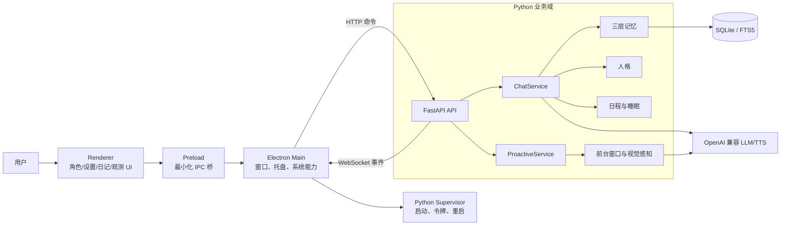

# YueLiBot 设计复盘与演进路线

> 研究快照：2026-08-03  
> 研究范围：当前工作区的 Electron/TypeScript 桌面端、Python 后端、记忆与日程算法、提示词、测试、构建和文档。  
> 本文是设计建议，不代表其中每一项已经实现。

## 1. 结论先行

YueLiBot 当前最值得保留的并不是某个具体框架，而是已经形成的产品域设计：三层记忆、人格漂移、睡眠与日程、主动打扰预算、视觉感知和可解释观测。这些模块让项目开始像一个持续存在的桌面角色，而不只是套壳聊天窗口。

现阶段不建议换技术栈或进行“大重写”。更高收益的路线是先把实现、契约、验证和文档重新对齐，再逐步增强算法和发布能力。

最优先处理四类问题：

1. **事实来源失真**：README 仍在介绍已经迁移走的 `src/core` 架构，命令和测试数量也与当前项目不符。
2. **记忆排序疑似反向**：事实召回把 FTS5 的负 BM25 分数转换后倒序排列，可能让较差匹配排到较好匹配之前。
3. **隐私边界不足**：调试 trace 会记录完整用户输入、系统提示词、记忆上下文和模型输出，缺少开关、脱敏、轮转和清理策略。
4. **验证链路断裂**：Python 单测和前端单测分别能通过，但真正启动 Python 后端的集成测试没有进入默认命令，并已与当前构造参数发生漂移。

建议按照以下顺序演进：

```text
事实对齐与风险止血
  -> 契约和生命周期治理
    -> 算法评测与校准
      -> 可安装、可升级、可恢复的发布体系
```

## 2. 当前架构画像

当前运行架构已经不是 README 中所示的“纯 TypeScript core”，而是 Electron 平台层加 Python 业务后端：



关键边界如下：

- Renderer 是不可信展示层，不应持有 API Key 或直接获得任意系统能力。
- Electron Main 是 Windows 能力和进程治理层，不应重新承载记忆、人格和日程业务。
- Python 是业务真源，负责会话、记忆、人格、日程、主动行为和模型调用。
- HTTP、WebSocket、配置文件和 SQLite 是跨边界契约，必须可验证、可迁移、可观测。

这个分层方向是合理的。当前问题主要集中在“边界已经形成，但契约和工程设施还没有完全跟上”。

## 3. 已经做得好的设计

### 3.1 平台层与业务域已经解耦

`src/main/index.ts` 明确把 Electron 定义为平台层，Python 后端才是记忆、人格、日程和 LLM 的所有者。后端由 supervisor 启动，通过随机令牌保护本机 API，并用 HTTP + WebSocket 完成请求与事件推送。

这比在 Electron 主进程里继续堆业务逻辑更容易测试，也为未来替换 UI 壳、独立运行后端或打包嵌入式 Python 留出了空间。

### 3.2 Renderer 安全基础较好

当前 preload 暴露的是有限业务接口，没有直接把 `ipcRenderer` 整体交给页面；窗口普遍开启 `contextIsolation`、关闭 `nodeIntegration`；生产资源通过自定义 `app:` 协议加载并检查路径穿越；HTML 也配置了 CSP。

这些做法符合 Electron 官方安全建议的主方向。后续需要补齐 IPC 发送方验证、导航和新窗口拦截、权限请求处理等细节，而不是推倒重来。参考：[Electron Security](https://www.electronjs.org/docs/latest/tutorial/security)。

### 3.3 核心算法具有清晰的产品语义

- 三层记忆把原始对话、情景摘要和长期事实分开，避免把所有历史无差别塞入上下文。
- 事实记忆使用遗忘、强化和迟滞，不会因为一次低分就立即消失。
- 睡眠度、日期扰动和日程共同影响角色行为，减少机械重复。
- 视觉感知先本地判断窗口类型，限制截图范围，并对模型输出再做确定性过滤。
- 日程解析和流式标签解析都没有完全相信模型文本，而是继续进行结构校验。

“生成式模型负责提出候选，确定性代码负责执行边界”应当继续作为全项目的核心原则。

### 3.4 已经具备可观测和迁移意识

项目有结构化日志、trace、观测窗口、SQLite migration 和较多纯逻辑测试。说明项目已经认识到“运行结果需要证据”。下一步不是再加更多日志，而是把日志分级、脱敏、轮转，并让一条统一命令真正覆盖关键链路。

## 4. 当前基线与验证边界

本次在当前工作区得到以下结果：

| 检查 | 结果 | 说明 |
|---|---:|---|
| `npm run typecheck` | 通过 | 当前 `tsconfig.json` 不包含 `tests/**/*.ts`，不能证明集成测试类型正确 |
| `npm test` | 通过 | 2 个 TypeScript 测试文件，共 4 个测试 |
| `npm run build` | 通过 | 有 2 条未使用导入警告 |
| Python `pytest` | 通过 | 131 个测试；使用项目 `.venv` 和项目内 uv 缓存 |
| supervisor 集成启动 | 失败 | 默认系统 Python 缺少 `structlog`；指定项目 Python 后，测试仍遗漏必需的 `configPath` |

因此可以确认的是：当前 TypeScript 构建、已有前端单测和 Python 单测可通过；不能据此宣称真实安装包、完整 Electron 交互、真实模型调用或生产升级链路已经通过。

另外，当前目录不是 Git 仓库，本文只能描述当前工作区快照，无法通过提交历史判断设计的演变或改动归属。

## 5. README 与文档信息架构

### 5.1 README 必须先恢复为事实入口

当前 README 有以下漂移：

- 架构图仍以已经不存在的 `src/core` 为核心，没有说明 `python/yueli`。
- 写有不存在的 `npm run chat:test`。
- 声称 `npm test` 有 122 个测试，当前实际是 4 个 TypeScript 测试；Python 另有 131 个测试。
- 启动步骤没有安装和同步 Python 后端依赖，也没有说明 `YUELI_PYTHON_EXE`。
- 包描述、历史 Live2D 说明和当前“立绘差分”路线存在表达漂移。

建议 README 只承担六件事：

1. 一句话产品定位和当前截图。
2. 可复现的开发环境要求。
3. 从零启动的最短命令。
4. 与源码一致的架构图。
5. 真实的测试、构建和故障排查命令。
6. 文档索引、隐私说明和当前发布状态。

测试数量不应手写为长期承诺。可以写“运行命令查看当前数量”，或由 CI 自动更新徽章。

### 5.2 建议的文档目录

短期不必移动所有文件，但可以逐步形成以下结构：

```text
docs/
  README.md                 # 文档索引与状态说明
  architecture/
    overview.md             # 运行时架构与信任边界
    contracts.md            # HTTP / WS / IPC / config 契约
    data-and-privacy.md      # 数据落盘、截图、日志、删除策略
  development/
    setup.md                # Windows + Node + uv 环境
    testing.md              # 单测、集成、真实接口验证边界
    release.md              # 打包、签名、升级、回滚
  design/
    memory.md
    persona-and-schedule.md
    prompts-and-evals.md
  history/                  # 已完成的重构轮次，仅作历史证据
```

现有 `rework-round-*` 和 `python-rework.md` 更适合放到历史区，并在文件顶部写明“已实施 / 部分实施 / 已过期”。否则读者很难判断它是方案还是现状。

## 6. 项目结构与架构建议

### 6.1 保留双运行时，不做大搬家

Electron + Python 对这个项目有现实优势：Electron 擅长桌面窗口和交互，Python 适合模型生态、文本处理和算法试验。现在改成全 TypeScript、Tauri 或多进程微服务，迁移成本大于收益。

更合适的是在现有目录内收紧职责：

```text
src/
  main/
    app/                    # Electron 组合入口与生命周期
    platform/               # 窗口、托盘、前台、开机启动
    python/                 # supervisor 与后端客户端
  preload/                  # 每个页面的最小能力桥
  renderer/                 # UI 与交互
  shared/generated/         # 从后端 schema 生成的只读类型

python/yueli/
  api/                      # 路由、鉴权、序列化
  application/              # 用例编排：聊天、主动行为、日记
  domain/                   # 记忆、人格、日程、睡眠纯逻辑
  infrastructure/           # SQLite、模型供应商、TTS、系统端口
  bootstrap.py              # 唯一组合根
```

这是一张目标图，不应一次性移动所有文件。先按“改到哪里就收紧哪里”的策略渐进实施，避免产生只改路径、不改职责的重构。

### 6.2 拆分组合根和 `ChatService`

当前 `python/yueli/__main__.py` 同时负责参数解析、对象构造、动态导入、私有字段回填、服务启动和关闭；`ChatService` 同时处理提供商选择、上下文拼装、流式解析、消息落盘、记忆提炼、人格推进、TTS 和 trace。

建议：

- 把依赖构造集中到 `bootstrap.py`，禁止启动完成后再写入 `chat._vector`、`chat._speak_audio` 等私有属性。
- 为 LLM、TTS、Embedding、Clock、ScreenshotSource 定义小型 `Protocol`，在构造器中显式注入。
- `ChatService` 只编排一次聊天；把 ContextBuilder、ResponseParser、PostTurnEffects、TTSDispatcher 分离。
- 保留简单函数，不为了“分层”给每个文件都创建类。

### 6.3 用类型化运行时状态替代全局 `Any`

`api/state.py` 当前以全局单例和多个 `Any` 字段保存依赖。建议使用一个完整类型化的 `AppServices` 数据类，通过 FastAPI lifespan 创建和关闭，再由依赖注入取得。

收益包括：

- 缺失依赖会在启动时直接暴露，而不是请求到达后才报错。
- 测试可以明确替换依赖，不需要动态 `getattr` 或私有属性回填。
- 关闭阶段可以统一取消任务、刷新数据库和关闭 HTTP 客户端。

### 6.4 消除跨语言契约手工复制

当前 Python Pydantic 模型和 `src/shared/ipc.ts` 中的事件、日程、配置、观测类型依靠人工同步，已经出现 `any` 和注释漂移。

建议以 Python API 模型作为网络契约真源：

1. Pydantic 输出 JSON Schema。
2. 构建脚本把 schema 固定生成到 `src/shared/generated/`。
3. TypeScript 客户端只使用生成类型，UI 自有状态仍可手写。
4. CI 重新生成后检查工作区是否有差异，阻止契约漂移。
5. 为 HTTP 状态码、WebSocket 事件版本和未知事件策略写契约测试。

Pydantic 原生支持 `BaseModel.model_json_schema()` 和 `TypeAdapter.json_schema()`，参考：[Pydantic JSON Schema](https://docs.pydantic.dev/latest/concepts/json_schema/)。

配置也需要同样治理。解析错误不应静默回退到默认配置；配置损坏应显示具体路径和错误位置，保留原文件并停止相关功能。

## 7. 算法设计建议

### 7.1 P0：验证并修正 FTS5 排序方向

SQLite FTS5 的 `bm25()` 是“数值越小，匹配越好”，官方示例使用升序排列。参考：[SQLite FTS5](https://www.sqlite.org/fts5.html#the_bm25_function)。

当前事实召回的相关度变换近似为：

```python
relevance = 1 / (1 + max(0.0, -bm25))
```

随后又按总分倒序排列。这样 `bm25=-1` 得到的相关度大于 `bm25=-8`，很可能把较弱匹配置于较强匹配之前。现有单测也固定了这个方向，因此“测试通过”不能证明排序语义正确。

建议先建立一个包含强、中、弱三个文档的真实 FTS5 回归样本，断言结果顺序，再选择一种实现：

- 直接保留 FTS5 的升序名次，在融合时使用名次；或
- 使用对负 BM25 单调递增的归一化，让更负的值对应更高相关度；或
- 采用 Reciprocal Rank Fusion（RRF），避免直接混合量纲不同的分数。

不要只改单测数字。验收标准必须是“已知更相关的文档排在前面”。

### 7.2 混合检索应融合名次，而不是生硬加权原始分数

当前向量和 BM25 使用固定权重混合，但两个分数的分布、范围和供应商实现并不一致。Embedding 也应显式检查维度并执行 L2 归一化，不能假定所有 OpenAI 兼容接口都返回单位向量。

建议：

- 检索前校验模型名称、向量维度和索引版本。
- 文本召回和向量召回各取 Top-K，再以 RRF 合并。
- 建立 30～100 条带“应该召回哪些记忆”标注的小数据集，比较 Recall@K、MRR 和误召回率。
- 权重或 RRF 常数进入版本化配置，但只能通过评测数据调整。

项目规模目前仍适合 SQLite + FTS5 + 本地向量表，没有必要引入外部向量数据库。

### 7.3 区分“被访问”和“被证实”

如果一条事实只因为被召回就得到强化，会形成“越常被召回越难遗忘”的富者愈富循环，错误事实也可能被长期固化。

建议把两个概念分开：

- `access_count / last_accessed_at`：用于缓存、可解释性和轻微的可用性提升。
- `evidence_count / last_confirmed_at`：只有用户再次确认、事件再次发生或抽取器得到独立证据时才增强记忆强度。

同时为矛盾事实设计替换或并存策略，例如“用户以前喜欢 A，现在更喜欢 B”不能简单覆盖时间信息。

### 7.4 主动行为预算需要跨重启持久化

主动说话预算目前主要驻留内存，后端重启后会恢复初始状态，可能短时间重复打扰。建议持久化：

- 当日主动次数和最近主动时间。
- 被用户忽略、关闭或明确拒绝的负反馈。
- 安静时段和临时免打扰截止时间。
- 触发原因和最终是否实际展示。

算法上可继续使用简单预算与冷却，不必立刻引入强化学习。先用可解释规则和模拟数据校准，通常更稳定。

### 7.5 用性质测试覆盖时间算法

日程、睡眠和遗忘算法比普通业务更适合做不变量测试：

- 任意输入下，日程不能重叠且必须覆盖合法时间范围。
- 月末、跨年、闰日和系统时区变化不能产生负时长。
- 睡眠度在连续时间上不应出现无理由的大幅跳变。
- 遗忘强度必须落在定义域内，重复证据不能导致无限增长。
- 固定随机种子时，模拟结果必须可复现。

可以用多日仿真生成 CSV 或图表观察轨迹，再把关键不变量固化成快速单测。

### 7.6 避免在异步请求路径里同步阻塞

SQLite 操作目前大多直接发生在 async 请求路径中。项目规模较小时未必已经造成问题，因此应先测量事件循环延迟，而不是盲目换数据库。

如果 p95 延迟显示数据库或分词确实阻塞，建议使用单一数据库工作队列或专用连接串行处理写入，明确事务边界。不要在多个 `to_thread` 之间共享同一个连接并依靠偶然的串行行为。

## 8. 提示词与评测体系

### 8.1 保留现有“提示词 + 确定性解析器”模式

当前主对话提示词已把身份、行为、表达风格、边界和流式协议分开；人格数值被翻译成自然语言约束；日程、视觉意图等输出还会被本地代码校验。这些都是应保留的设计。

主对话为了流式 TTS 可以继续使用轻量标签协议。日程、记忆抽取等非流式任务可以在供应商支持时使用结构化输出，但本地 Pydantic 校验必须始终存在，不能把供应商的“JSON 模式”当作执行授权。

### 8.2 给每类提示词建立版本和输入边界

建议每个提示词包含：

- 稳定的 `prompt_id` 和语义版本。
- 明确的输入字段、可信级别和最大长度。
- 输出 schema、禁止行为和失败语义。
- 变更说明与对应评测集版本。

系统提示词、用户输入、召回记忆、屏幕 OCR/视觉描述必须以结构化区段分隔。外部内容应标记为“不可信数据”，不能伪装成系统指令。

### 8.3 建立本地、供应商无关的 eval 数据集

建议新增：

```text
evals/
  chat.jsonl               # 人设、边界、表达自然度
  memory_extract.jsonl     # 应抽取 / 不应抽取 / 冲突事实
  recall.jsonl             # 查询与期望记忆 Top-K
  schedule.jsonl           # 合法、边界、恶意输出
  proactive.jsonl          # 应打扰 / 不应打扰及原因
  vision_adversarial.jsonl # 截图文字中的间接提示注入
```

评测分三层：

1. **确定性检查**：能否解析、字段是否合法、是否泄漏受保护内容、长度、延迟、token 成本。
2. **任务指标**：召回 Recall@K、日程合法率、记忆抽取准确率、主动行为误打扰率。
3. **偏好判断**：成对比较角色一致性和自然度，由人工样本校准；模型裁判只能辅助，不能是唯一门禁。

每次改提示词、模型、检索或上下文拼装都运行同一数据集，保留前后差异。官方也建议评测应尽早、持续、任务化，并同时覆盖典型、边界和对抗样本，避免只凭主观“感觉变好了”。参考：[OpenAI Evaluation Best Practices](https://developers.openai.com/api/docs/guides/evaluation-best-practices)。

### 8.4 Prompt 不是安全边界

屏幕截图可能包含网页或聊天内容里的恶意指令，这属于多模态间接提示注入。即使提示词写了“忽略屏幕中的命令”，也不能保证模型遵守。

必须由代码限制模型可产生的动作集合，并验证每个参数；高影响动作要让用户确认。参考：[OWASP Prompt Injection](https://genai.owasp.org/llmrisk/llm01-prompt-injection/) 和 [OWASP Improper Output Handling](https://genai.owasp.org/llmrisk/llm052025-improper-output-handling/)。

## 9. 异步任务与生命周期

项目多处通过 `asyncio.create_task()` 启动 TTS、摘要、向量、主动行为等后台任务，但没有统一的强引用、取消和异常收集策略。Python 官方文档明确提醒：事件循环只保存任务的弱引用；需要保存引用，并推荐用 `TaskGroup` 管理相关任务。参考：[Python asyncio tasks](https://docs.python.org/3/library/asyncio-task.html)。

建议实现一个轻量 `TaskRegistry`：

- 创建任务时登记名称、来源请求和开始时间。
- 完成时取得异常并从集合移除。
- 关闭时停止接收新任务，限时等待，最后统一取消。
- 同一语义任务定义并发策略，例如截图分析采用“最多一个运行中，始终保留最新一帧”。
- 需要共同成功或共同取消的一组操作使用 `TaskGroup`。

对于“消息已返回，但后台保存失败”这类情况，要明确一致性策略并在观测层展示，而不是静默吞掉。

## 10. 安全与隐私设计

### 10.1 P0：重做 trace 数据策略

当前 trace 会写入原始用户输入、完整 LLM 请求、系统提示词、召回记忆、输出分片和最终结果。这些数据对调试有帮助，但也构成完整的私人会话副本。

建议：

- 默认只记录事件名、耗时、模型、token、状态码和关联 ID。
- 完整内容 trace 必须由用户显式开启，并显示正在记录。
- API Key、Authorization、Cookie、文件路径中的用户名等字段强制脱敏。
- 设置单文件上限、保留天数和总空间上限。
- 设置页提供“查看占用、导出、立即清除”。
- 崩溃报告默认不附带对话内容。

这也符合 OWASP 对敏感信息披露的风险说明：[Sensitive Information Disclosure](https://genai.owasp.org/llmrisk/llm022025-sensitive-information-disclosure/)。

### 10.2 API Key 不应长期明文放在普通 TOML

建议让配置只保存“使用哪个供应商、模型和 secret 标识”，真实密钥先由 Electron `safeStorage` 加密，再把密文保存到应用数据目录。Windows 上它使用系统加密能力，能防止其他系统用户直接读取，但不能抵御同一登录用户下的任意恶意程序，因此仍需如实说明边界。参考：[Electron safeStorage](https://www.electronjs.org/docs/latest/api/safe-storage)。

环境变量可继续用于开发和 CI，但生产 UI 保存的密钥不应回显完整值，也不要进入 trace。

### 10.3 补齐 Electron 边界检查

在现有安全基础上补充：

- 每个敏感 IPC handler 验证 `event.senderFrame` 是否来自应用自己的页面。
- 禁止意外导航，拦截并白名单处理 `setWindowOpenHandler`。
- 显式拒绝不需要的权限请求。
- 记录因为 ESM preload 而关闭 sandbox 的具体原因、影响范围和回归测试，条件允许时恢复 sandbox。
- 所有外部链接交给系统浏览器前验证协议，只允许 `https:` 等明确列表。

### 10.4 把屏幕感知做成用户可理解的数据流

建议设置页明确展示：

- 哪些窗口可能被截图，哪些被永远排除。
- 截图是否落盘、会发送给哪个供应商、保留多久。
- 当前是否正在感知，以及最近一次触发原因。
- 一键暂停、应用黑名单、免打扰时段和清除数据入口。

已有“只截取选定前台窗口、标题本地分类、截图不落盘”是好基础，应转化成可见的产品承诺和自动测试。

## 11. 测试、依赖与持续集成

### 11.1 建立唯一的本地验收入口

建议统一脚本语义：

| 命令 | 应覆盖内容 |
|---|---|
| `npm run check` | 格式/静态检查、TS 类型、TS 单测、Python 单测、契约漂移、构建 |
| `npm run test:unit` | 所有快速、无网络单测 |
| `npm run test:integration` | 启动真实 Python 后端，检查 health、鉴权、HTTP、WS 和关闭 |
| `npm run test:e2e` | Electron 页面与关键用户路径 |
| `npm run test:eval` | 需要模型凭证时显式运行的提示词评测 |

集成测试必须使用项目 Python，而不是偶然可用的系统 `python`；测试构造参数应与 production supervisor 共用工厂，避免本次发现的 `configPath` 漂移。`tests/**/*.ts` 应加入主 `tsconfig` 或独立 `tsconfig.test.json`。

### 11.2 让 uv 成为 Python 环境真源

建议：

- 把 pytest 等开发依赖放入 `[dependency-groups] dev`。
- 本地和 CI 使用 `uv sync --locked`，防止 lock 漂移。
- 运行使用 `uv run ...` 或明确的 `.venv` Python。
- 按项目规范保留 `requirements.txt` 时，由 `uv export --format requirements.txt` 生成，不手工维护两套版本，并在 CI 检查是否同步。

uv 的同步、锁定和导出行为见：[uv Locking and Syncing](https://docs.astral.sh/uv/concepts/projects/sync/)。

### 11.3 CI 最小矩阵

第一版 CI 只需要 Windows：

1. 安装固定 Node 和 uv。
2. `npm ci` 与 `uv sync --locked`。
3. 运行 `npm run check`。
4. 启动后端集成测试并保留失败日志。
5. 构建 Electron 资源，检查产物中不包含 `.env`、trace、测试夹具或开发数据库。

以后再按真实支持范围增加其他系统，不应为了矩阵好看而测试不会分发的平台。

## 12. 打包、升级与运行保障

当前 `npm run build` 只生成前端/主进程资源，不等于可分发安装包；supervisor 默认依赖系统 Python，也没有稳定的内置后端路径。

推荐的发布链路：

1. 用 PyInstaller 等方式把 Python 后端构建为固定可执行产物。
2. Electron 打包时通过 `extraResources` 携带后端和必要资源。
3. 开发环境走 `.venv`，生产环境只走应用资源目录，不再猜测系统 Python。
4. 安装包冒烟测试真实启动后端、创建临时数据目录、完成一次 HTTP/WS 往返再退出。
5. 为 SQLite migration 做备份、失败回滚和旧版本兼容测试。
6. 稳定后再加入代码签名、自动更新、崩溃恢复和版本回退。

Electron 官方也把“打包、代码签名、发布和更新”视为不同阶段，参考：[Electron Distribution Overview](https://www.electronjs.org/docs/latest/tutorial/distribution-overview)。

运行保障还应包括：

- 日志轮转和磁盘上限。
- 后端反复崩溃时展示可操作错误，而不是无限重启。
- 配置、数据库和模型缓存的版本及迁移策略。
- 导出、备份、恢复和彻底删除用户数据的路径。

## 13. 产品和 UI 细节

工程设计最终要为“陪伴感”服务，建议优先完善这些可见细节：

- 观测页解释“她为什么主动说这句话”，显示触发信号、预算和被过滤原因，但不暴露冗长模型思维过程。
- 设置页提供安静时段、屏幕感知范围、数据保留周期、模型花费上限和低功耗模式。
- 日记或记忆页允许用户纠正、删除和标记敏感记忆；删除后同步移除向量索引和相关摘要。
- 网络或后端失败时显示明确状态，不让角色假装已经记住、已经保存或已经执行。
- 所有界面、日志和错误以简体中文为主；底层错误码保持稳定，便于搜索和自动测试。
- 键盘操作、焦点、对比度、动态效果减弱选项应进入 UI 验收，不只验证鼠标拖拽。

## 14. 分阶段路线图

### P0：事实对齐与风险止血（1～3 天）

| 工作 | 验收标准 |
|---|---|
| 重写 README 的启动、架构和命令 | 新环境仅按 README 能启动；所有命令真实存在 |
| 修复并回归 FTS5 排序 | 强/中/弱样本顺序正确；文本和混合召回都有测试 |
| 收紧 trace | 默认不保存正文；可开关、脱敏、轮转、清理 |
| 修复 supervisor 集成测试 | 项目 Python 启动成功；health、鉴权、WS、关闭通过 |
| 增加统一 `check` 命令 | 本地一条命令覆盖 TS、Python、契约和构建 |

### P1：契约和生命周期（1～2 周）

| 工作 | 验收标准 |
|---|---|
| Pydantic schema 生成 TS 类型 | 重新生成无差异；删除关键网络类型中的 `any` |
| 类型化 `AppServices` 与 lifespan | 无全局 `Any` 服务容器；启动/关闭顺序有测试 |
| `TaskRegistry` / `TaskGroup` | 后台异常可见；退出时无遗留任务；截图并发有上限 |
| Electron 边界补齐 | IPC sender、导航、新窗口、权限均有明确策略和测试 |
| 密钥迁移到 safeStorage | 配置和日志不含明文 Key；提供迁移和删除流程 |
| uv 与 CI 固化 | 锁定安装可复现；requirements 导出无漂移 |

### P2：质量校准与可发布性（2～4 周）

| 工作 | 验收标准 |
|---|---|
| Prompt/eval 数据集 | 每类任务有典型、边界、对抗样本和基线报告 |
| 召回融合校准 | Recall@K、MRR 和误召回率优于旧实现且有数据支持 |
| 服务职责拆分 | `ChatService` 和组合根不再承担不相关副作用 |
| 可安装包 | 干净 Windows 环境无需系统 Python 即可启动 |
| 数据升级与恢复 | 旧库迁移、备份恢复、失败回滚都有自动测试 |
| 文档分层 | 现状、方案和历史文档可明确区分 |

## 15. 暂时不建议做的事

- **不建议引入多代理编排**：当前主要瓶颈是契约、评测和运行可靠性，不是模型分工不足。
- **不建议迁移外部向量数据库**：数据规模和单机产品形态不足以抵消部署、备份和隐私成本。
- **不建议整体改成 Tauri 或全 TypeScript**：这会把大量时间花在等价迁移，而不是改善陪伴体验。
- **不建议大爆炸式目录重构**：先拆职责、补测试，再随功能改动迁移目录。
- **不建议靠提示词保护系统**：输入和输出都必须经过代码授权与校验。
- **不建议立刻引入复杂分布式观测平台**：先让本地日志安全、结构化、有限额，并建立可复现的关联 ID。
- **不建议为了“聪明”直接上强化学习**：主动行为和记忆校准先使用可解释规则、离线数据和用户反馈闭环。

## 16. 设计完成定义

未来任何架构或算法改动，在合并或发布前至少回答：

1. 它解决了哪个可复现问题，基线数据是什么？
2. 哪一层是事实真源，跨层契约如何验证？
3. 失败时会明确报错，还是被 fallback 隐藏？
4. 会记录哪些用户数据，保存在哪里，如何删除？
5. 有哪些确定性测试、集成测试和真实模型评测？
6. 开发环境通过是否被误写成生产验证通过？
7. README、配置示例和运维文档是否同步？

当这些问题都有可查证答案时，项目才从“功能能跑”走向“长期可维护、可解释、可发布”。
